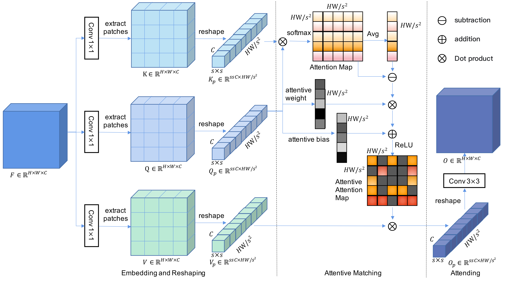

# Attentive Contextual Attention for Cloud Removal

[Wenli Huang](https://scholar.google.com/citations?user=CD1TJyAAAAAJ), [Ye Deng](https://www.researchgate.net/profile/Ye-Deng-9), Yang Wu, and [Jinjun Wang](https://scholar.google.com/citations?user=Dk7JgNcAAAAJ), "Attentive Contextual Attention for Cloud Removal", IEEE Transactions on Geoscience and Remote Sensing (TGRS), 2024

[paper] [[arXiv](http://arxiv.org/abs/2411.13042)] [[pretrained models](https://pan.baidu.com/s/1M6Mvwy7L6OWWk_Xv8aKFlA?pwd=4qgh)]

#### 🔥🔥🔥 News

- **2024-10-04:** Code and pre-trained models are released. 🎊🎊🎊

---

> **Abstract:** Cloud cover can significantly hinder the use of remote sensing images for Earth observation, prompting urgent advancements in cloud removal technology. Recently, deep learning strategies, especially convolutional neural networks (CNNs) with attention mechanisms, have shown strong potential in restoring cloud-obscured areas. These methods utilize convolution to extract intricate local features and attention mechanisms to gather long-range information, improving the overall comprehension of the scene. However, a common drawback of these approaches is that the resulting images often suffer from blurriness, artifacts, and inconsistencies. This is partly because attention mechanisms apply weights to all features based on generalized similarity scores, which can inadvertently introduce noise and irrelevant details from cloud-covered areas. To overcome this limitation and better capture relevant distant context, we introduce a novel approach named Attentive Contextual Attention (AC-Attention). This method enhances conventional attention mechanisms by dynamically learning data-driven attentive selection scores, enabling it to filter out noise and irrelevant features effectively. By integrating the AC-Attention module into the DSen2-CR cloud removal framework, we significantly improve the model's ability to capture essential distant information, leading to more effective cloud removal. Our extensive evaluation of various datasets shows that our method outperforms existing ones regarding image reconstruction quality. Additionally, we conducted ablation studies by integrating AC-Attention into multiple existing methods and widely used network architectures. These studies demonstrate the effectiveness and adaptability of AC-Attention and reveal its ability to focus on relevant features, thereby improving the overall performance of the networks. 




---


## ⚙️ Installation

- Python 3.6

- PyTorch 1.8.1

- NVIDIA GPU + [CUDA](https://developer.nvidia.com/cuda-downloads) 11.1

- Create conda environment:

  ```bash
  conda create -n ACA-CRNet python=3.6
  conda deactivate
  conda activate ACA-CRNet
  pip install visdom dominate
  ```
- Clone this repo:

  ```bash
  git clone https://github.com/huangwenwenlili/ACA-CRNet.git
  cd ACA-CRNet
  ```

 - Pip install libs:

  ```bash
  pip install -r requirements.txt -f
  ```


## 🔗 Contents

1. [Datasets](#datasets)
1. [Models](#models)
1. [Training](#training)
1. [Testing](#testing)
1. [Results](#results)
1. [Citation](#citation)
1. [Acknowledgements](#acknowledgements)

---


## <a name="datasets"></a>🖨️ Datasets
- ```RICE-I```: It consists of 500 pairs of filmy and cloud-free images obtained from Google Earth. 
[RICE-I](https://github.com/BUPTLdy/RICE_DATASET)

- ```RICE-II```: It consists of 736 pairs of images captured by Landsat 8 OLI/TIRS, including cloudy, cloudless, and mask images. The mask images were created using the Landsat Level-1 quality band to identify regions affected by clouds, cloud shadows, and cirrus clouds. The cloudless images were captured at the same location as the corresponding cloud images with a maximum interval of 15 days. [RICE-II](https://github.com/BUPTLdy/RICE_DATASET)

- ```SEN12MS-CR```:It contains approximately 110,000 samples from 169 distinct, non-overlapping regions across various continents and meteorological seasons. Each sample includes a pair of Sentinel-2 images, one cloudy and one cloud-free, along with the corresponding Sentinel-1 synthetic aperture radar (SAR) image. [SEN12MS-CR](https://mediatum.ub.tum.de/1554803)


Download training and testing datasets and put them into the corresponding folders of `datasets/`.


## <a name="models"></a>📦 Models

[Rice1 model Baidu Disk](https://pan.baidu.com/s/19a8Hv9m2XZ-etIQ8ag7nlg?pwd=asvf),

[Rice2 model Baidu Disk](https://pan.baidu.com/s/1__eaIT3MTz9k4qJRaXm_yw?pwd=bund)

[SEN12MS-CR model Baidu Disk](https://pan.baidu.com/s/1zcl5OqDoTHW7cg60g_67mA?pwd=kegq)


## <a name="training"></a>🔧 Training

- Download [RICE](https://github.com/BUPTLdy/RICE_DATASET) and [SEN12MS-CR](https://mediatum.ub.tum.de/1554803) datasets, place them in `datasets/`.

- Run the following scripts for visdom.server. To see the training images and loss in the browser, if you do not want this feature, please delete the code containing "vis" in train_*.py.
 ```shell
  screen -s visdom
  conda activate ACA-CRNet
  python -m visdom.server
 ```

- Run the following scripts. The training configuration is in `config_rice1.py` and `config_rice2.py`.

  ```shell
  # RICE1, input=128*128, 1 GPU
  python train_rice1.py
  
  
  # RICE2, input=128*128, 1 GPU
  python train_rice2.py
  ```
   ```
  - Set `train_dataset_dir` as the train dataset path.
  - Set `val_dataset_dir` as the valid dataset path.
  - Set `output_dir` as img results path. Default as *./results* folder.
  - Set `net_state_dict_save_dir` as the training model *.pth path. Default as *./experiments/rice1-models/* folder.
  - Set `net_init` as the pretrained-model path. When training from scratch, set `net_init = None` in either `config_rice1.py` or `config_rice2.py`. When performing fine-tuning, set `net_init` to the path of a `.pth` file.

   ```

- The training experiment is in `experiments/`.


## <a name="testing"></a>🔨 Testing

### 🌗 Test images with HR

- Download the pre-trained [models](https://pan.baidu.com/s/1M6Mvwy7L6OWWk_Xv8aKFlA?pwd=4qgh) and place them in `experiments/pretrained_models/`.

- Use RICE1 and RICE2 testing datasets.

- Test the model. The testing configuration is in `config_rice1.py` and `config_rice2.py`.

  ```shell
  # RICE1
  python predict_rice1.py 

  # RICE2
  python predict_rice2.py 
  ```
  ```
  - Set `predict_dataset_dir` as the test dataset path.
  - Set `output_dir` as img results path.
  - Set `net_init` as the pretrained-model path.
  - The default results will be saved under the *results* folder.
  ```

## <a name="results"></a>🔎 Results

We achieved state-of-the-art performance. Detailed results can be found in the paper.

<details>
<summary>Quantitative Comparison (click to expand)</summary>

- results in Table III of the main paper

<p align="center">
  
</p>

</details>

<details>
<summary>Visual Comparison (click to expand)</summary>

- results in Figure 4 of the main paper

<p align="center">
  
</p>


- results in Figure 7 of the main paper

<p align="center">
  
</p>


</details>


## <a name="citation"></a>📎 Citation

If you find the code helpful in your research or work, please cite the following paper(s).

```
@inproceedings{huang2024acarmnet,
  title={Attentive Contextual Attention for Cloud Removal},
  author={Wenli Huang, Ye Deng, Yang Wu, Jinjun Wang},
  booktitle={TGRS},
  year={2024}
}
```

## License
<br />
The codes and the pre-trained models in this repository are under the MIT license as specified by the LICENSE file.
This code is for educational and academic research purpose only.

## <a name="acknowledgements"></a>💡 Acknowledgements

This code is built on [DSEN2_CR_PYTORCH](https://github.com/Phoenix-Shen/DSEN2_CR_PYTORCH).

